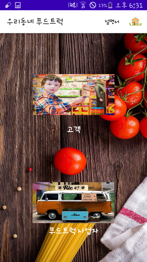
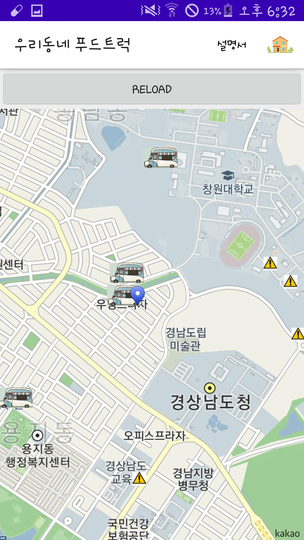

# 우리동네 푸드트럭

## 프로젝트 인원 : 4명

## 사용기술 

AndroidStudio, Java, Mysql, 닷홈(서버), PHP(데이터 베이스 통신), SQLLITE, Geocode(주소 반환 위함)

## 배경 

3학년2학기 학부 수업인 소프트웨어공학 수업에서 다른 팀이 설계한 문서를 바탕으로 소프트웨어공학 관점에 맞게 설계팀과 소통하며 프로젝트를 진행하였다. 우리동네 푸드트럭은 푸드트럭의 접근성을 높이는 동시에 푸드트럭을 운영하는 사업자들의 경제를 살리기 위한 바람이다.

## 담당업무

- 닷홈 무료호스팅을 이용하여 서버를 열고 닷홈에서 제공하는 mysql을 이용하여 데이트베이스 구축
- 애플리케이션의 UI 개발
- 전체적인 애플리케이션 구성
- 애플리케이션 로직 구성

## 앱 구성

### 메인화면

앱을 들어갔을 때 처음 메인화면이다.

### 고객 버튼

- 위치설정 : 고객의 위치를 설정할 수 있는 버튼이다. 위치를 현재위치나 주소를 입력받아 Geocoder를 이용해 좌표값으로 변환하여 설정한다.
- 위치기반 검색 : 설정한 위치를 기준으로 반경 1km 내에 있는 푸드트럭들을 보여준다. 위치 설정을 하지 않을시에 창원대학교로 설정된다.
- 푸드트럭명 검색 : 푸드트럭의 이름으로 푸드트럭을 검색할 수 있으며 영업중인 푸드트럭은 상단에 영업종료한 푸드트럭은 하단에 표시된다.

### 고객 위치 설정

### 푸드트럭 조회

영업중인 푸드트럭은 푸드트럭 이미지로 영업이 종료된 푸드트럭은 준비중이라는 의미를 가지는 이미지로 표시된다.

### 푸드트럭 검색

### 푸드트럭 상세정보

- 지도에서 푸드트럭 아이콘을 클릭 후 말풍선을 클릭해서 상세정보를 보거나 푸드트럭을 검색하여 상세정보를 눌렀을 때 그 푸드트럭의 메뉴와 운영정보, 가게명, 거래방법, 평점들의 정보가 뜨게 된다.
- 리뷰남기기 버튼을 통해 1점부터 5점까지 리뷰를 남길 수 있다.

### 사업자 버튼

사업자가 등록한 푸드트럭 정보가 뜨게 되며 등록, 수정, 삭제가 가능하다.

### 사업자 푸드트럭 수정

메뉴 수정 화면으로 메뉴 등록과 삭제가 가능하고 운영정보 버튼을 누를시에 구성은 동일하다.